# Dokumentáció

## Hammer - a Smith Games webshopja

Készítette: Kovács Attila

### 1. Követelményanalízis

#### 1.1 Célkitűzés, projektindító dokumentum

A program célja egy olyan, főként játékosoknak szánt alkalmazás biztosítása, melyen keresztül a felhasználók egyszerűen böngészhetnek a különböző játékok között, azokat megvásárolhatják, hozzászólásokat írhatnak hozzájuk és értékelhetik azokat. Az alkalmazás teljeskörű használata regisztrációhoz kötött. Belépés után lehetőségünk van profilunk megtekintéséhez, ahol láthatjuk alapvető adatainkat, eddigi vásárlásainkat, hozzászólásainkat, s lehetőségünk van új játékok vásárlására, valamint értékelésére. A regisztrálatlan látogatóknak megtekinthetik az egyes játékokat, s az ott megjelenő értékeléseket.

###### Funkcionális követelmények:

- Regisztráció
- Bejelentkezés
- Csak bejelentkezett felhasználók által elérhető funkciók:
  - Profil megtekintése:
    - alapvető adatok
    - eddig vásárolt játékaink
    - játékaink kedvencekhez tétele
    - eddigi hozzászólásaink
  - Játékok vásárlása
  - Általunk megvásárolt játékok értékelése
- Nem regisztrált felhasználók által elérhető funkciók:
  - A megvehető játékok listájának megtekintése
  - Az egyes játékok adatlapjának megtekintése, ahol láthatjuk az ide tartozó értékeléseket is

###### Nem funkcionális követelmények:

- Könnyű áttekinthetőség 
  - A játékok áttekinthető listában való megjelenítése, kategória címkékkel ellátva
  - A felhasználói profilban az adatok elkülönített, rendezett megjelenítése
- Használhatóság 
  - Könnyű áttekinthetőség, ésszerű elrendezés, könnyen kezelhetőség
- Megbízhatóság
  - Jelszóval védett funkciók, és a jelszavak védelme a háttérben
  - Hibásan bevitt adatok esetén a program jól láthatóan jelezzen a felhasználónak, és emelje ki a hibás beviteli mezőket
  - Regisztrációnál a jól bevitt adatok maradjanak az űrlapban
  - Megerősítés kérése bizonyos tevékenységek előtt (pl. vásárlás, játékok kedvencek közül való eltávolítása stb.)
- Karbantarthatóság
  - Könnyen lehessen bővíteni 
  - A különböző típusú fájlok külön csoportosítva, ésszerűen legyenek felbontva, a könnyebb fejleszthetőség miatt

#### 1.2 Szakterületi fogalomjegyzék

###### Kategória címkék:

- **Action**: akció játékok
- **Adventure**: kaland játékok
- **Casual**: alkalmi játékok
- **Indie**: indie játékok
- **MMO**: online többjátékos játékok
- **Racing**: versenyzős játékok
- **RPG**: szerepjátékok
- **Simulation**: szimulátor játékok
- **Sports**: sport játékok
- **Strategy**: stratégiai játékok

#### 1.3 Használatieset-modell, funkcionális követelmények

**Vendég**: Csak a publikus oldalakat éri el.
- Főoldal
- Bejelentkezés
- Regisztráció
- Játékok listájának megtekintése
- Játékok adatlapjának megtekintése

**Bejelentkezett felhasználó**: A publikus oldalak elérésén felül egyéb funkciókhoz is hozzáfér.
- Saját adatlap megtekintése
- Játékok vásárlása
- Kedvenc játékok kezelése
  - Játékok felvétele a kedvencek közé
  - Játékok törlése a kedvencek közül
- Megvásárolt játékok értékelése

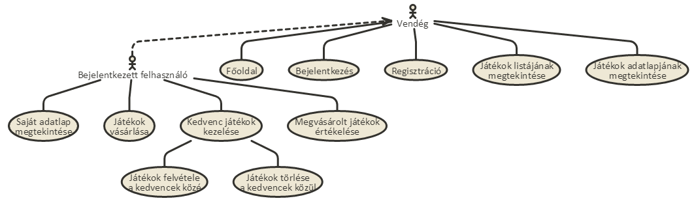

Vegyünk példának egy egyszerű folyamatot:

**Játék vásárlása:**
  1. A látogató az oldalra érkezve bejelentkezik, vagy ha még nincs felhasználói fiókja, akkor regisztrál.
  2. A belépés után megtekinthetjük a játékok listáját, s kiválaszthatjuk, hogy melyeket szeretnénk megvásárolni.
  3. A megvásárolni kívánt játékokat a kosárba helyezhetjük, s folytathatjuk a böngészést, vagy továbbléphetünk a fizetéshez.
  4. A játékok kifizetése után azok bekerülnek a saját játékaink közé.
  
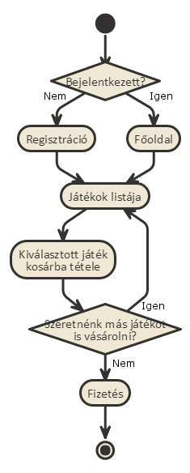

### 2. Tervezés

#### 2.1 Architektúra terv

###### 2.1.1 Komponens diagram
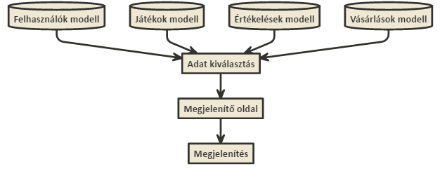

###### 2.1.2 Oldaltérkép
**Publikus**:
- Főoldal
- Játékok listája
- Játékok adatlapja
- Bejelentkezés
- Regisztráció

**Bejelentkezett**:
- Kilépés
- Profil
  - Profiladatok megtekintése
  - Vásárolt játékok megtekintése
  - Kedvenc játékok megtekintése
  - Játékok kedvencekhez tétele
  - Értékeléseink megtekintése
  - Vásárlásaink megtekintése
- Játékok adatlapja
  - Játék kosárba helyezése
  - Értékelés írása
- Kosár

###### 2.1.3 Végpontok
- GET/: Főoldal
- GET/login: Bejelentkező oldal
- POST/login: Bejelentkezési adatok elküldése
- GET/login/signup: Regisztrációs oldal
- POST/login/signup: Regisztrációs adatok elküldése
- GET/logout: Kijelentkező oldal
- GET/games/list: Játékok listája
- GET/games/id: Játék adatlapja
- POST/games/id: Új hozzászólás elküldése
- GET/users/id: Felhasználó adatlapja
- POST/users/favourites/id: Játék kedvencekhez adása
- POST/users/purchases/new: Vásárlási adatok elküldése
- GET/basket: Kosarunk megtekintése
- POST/basket/id: Játék kosárba helyezése

#### 2.2 Felhasználói-felület modell

###### 2.2.1 Oldalvázlatok
**Főoldal**
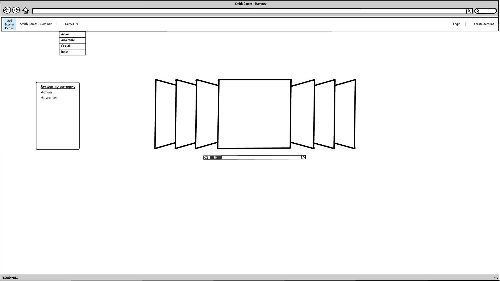

**Játékok listája**
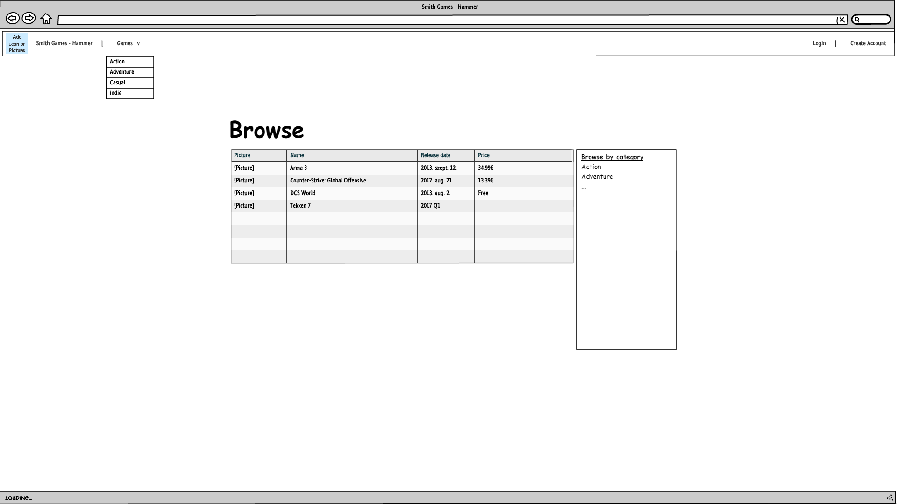

**Játék adatlapja**
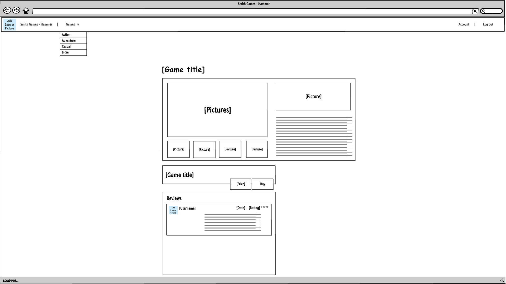

**Felhasználó adatlapja**
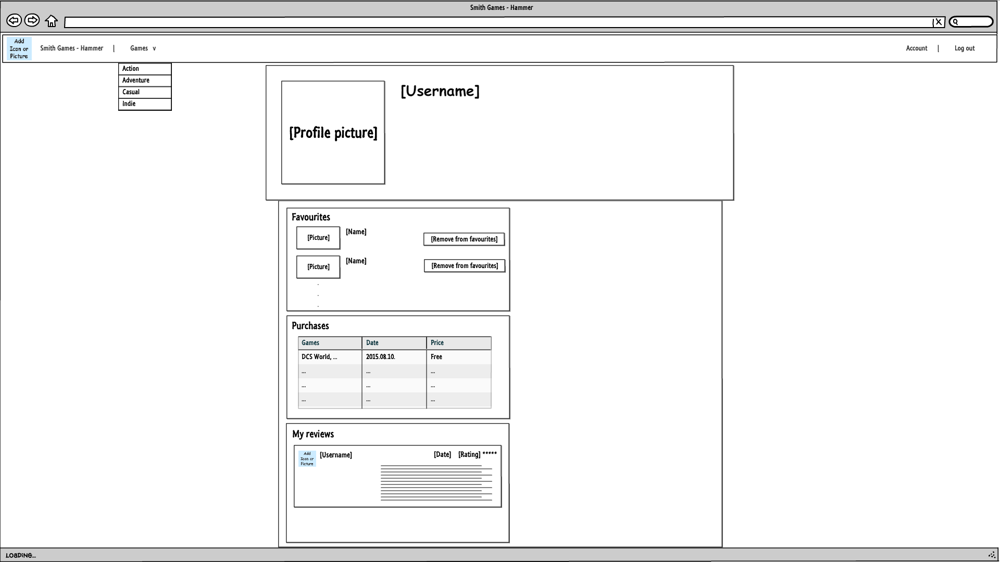

**Kosár**
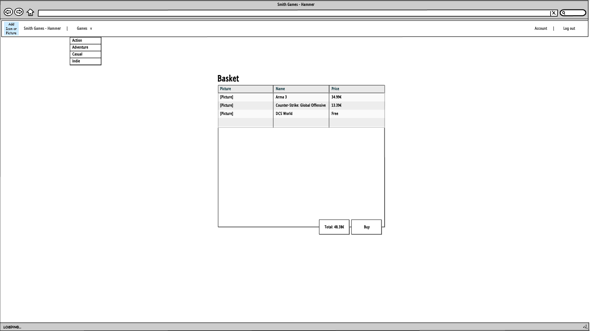

**Bejelentkezés**
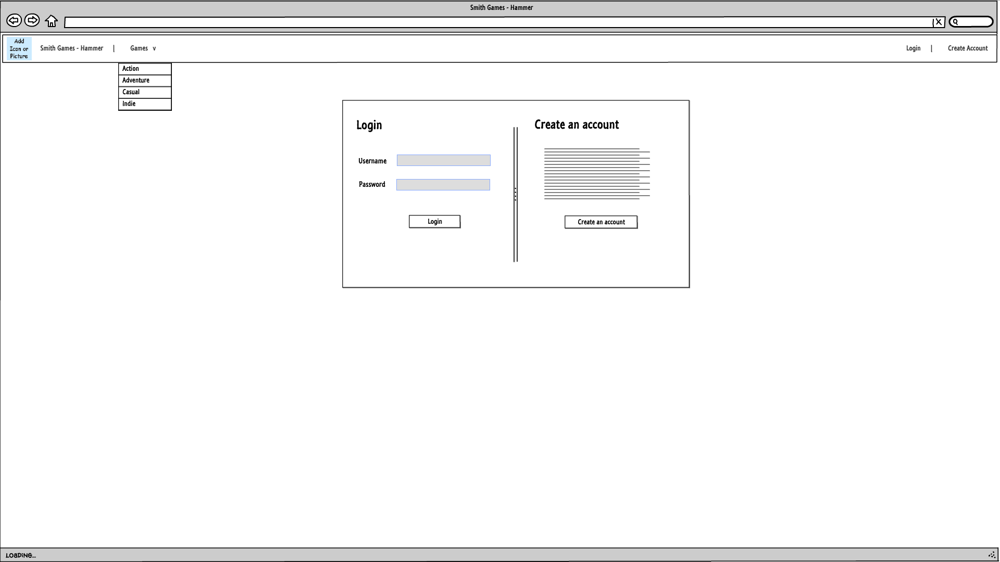

**Regisztráció**
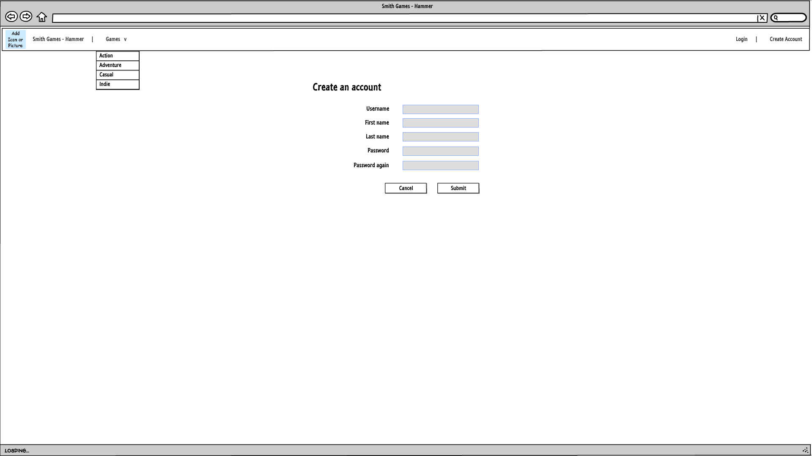

###### 2.2.2 Designtervek (végső megvalósítás megjelenése)

###### 2.2.3 Osztálymodell

**Adatmodell**

**Adatbázisterv**

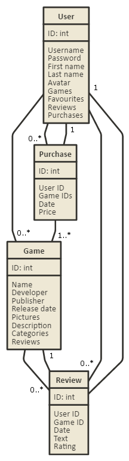

###### 2.2.4 Dinamikus működés
**Szekvencia diagram**

Az alábbi diagram a regisztráció, bejelentkezés, s egy játék vásárlásának folyamatát mutatja be.
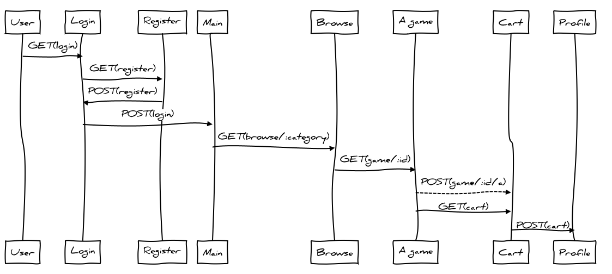
