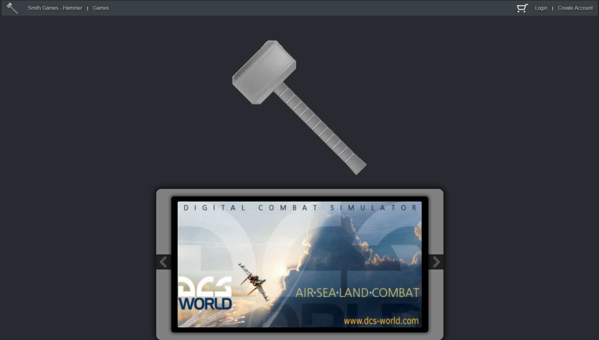
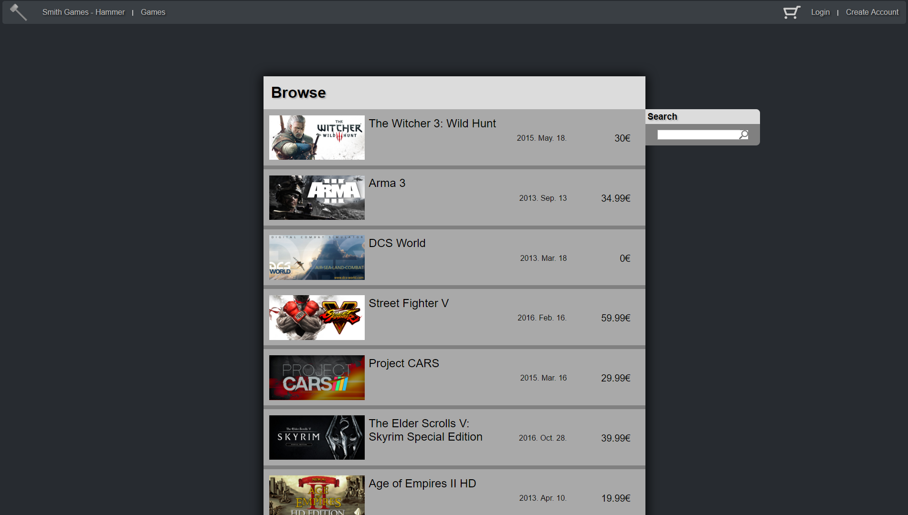
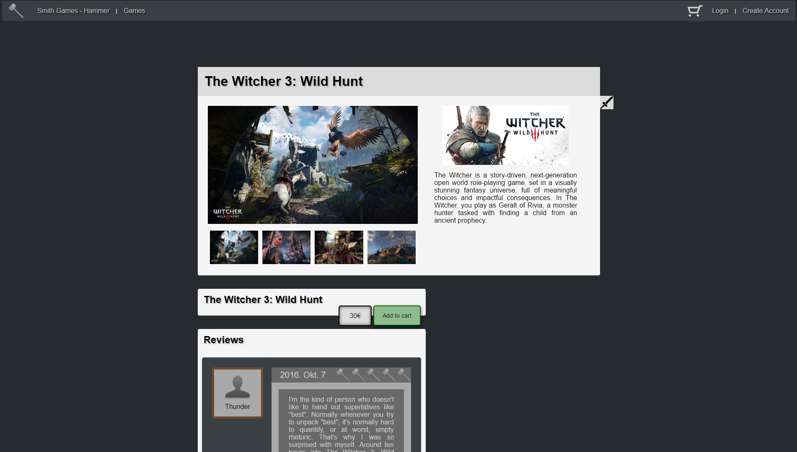
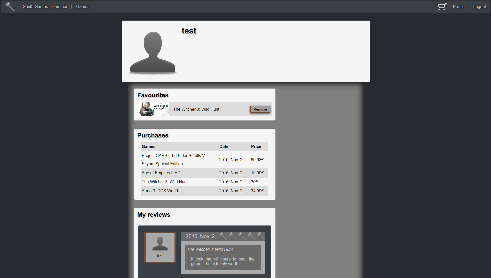
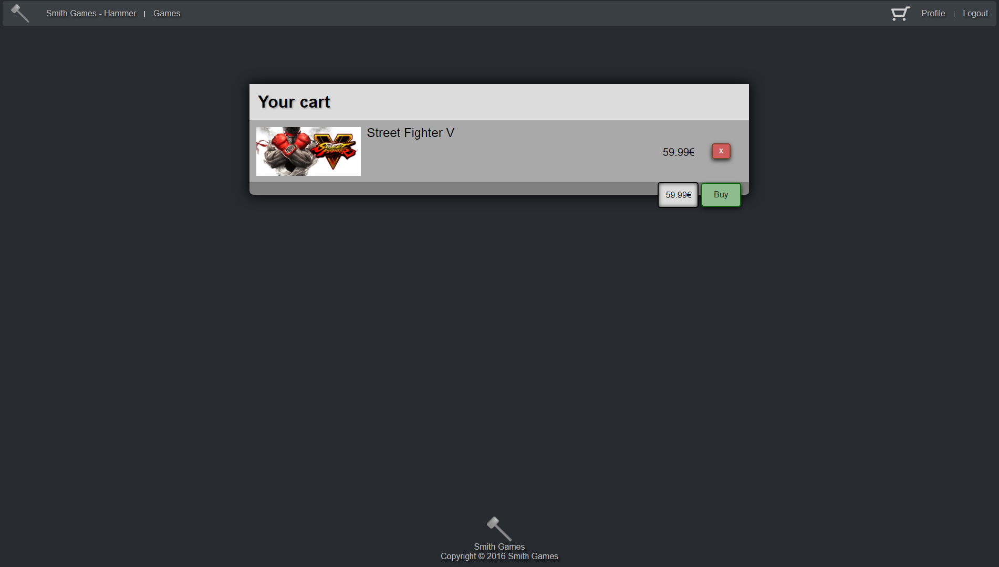
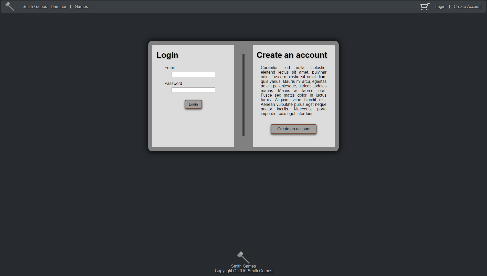
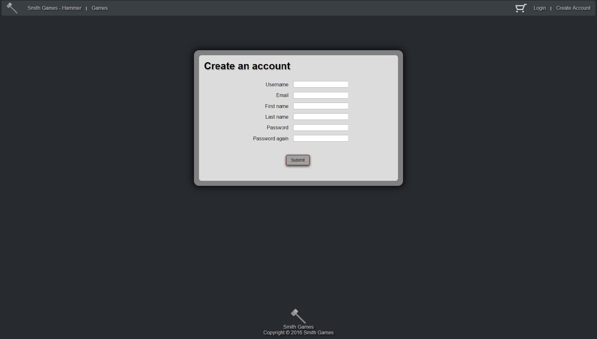

# Dokumentáció

## Hammer - a Smith Games webshopja

Készítette: Kovács Attila

### 1. Követelményanalízis

#### 1.1 Célkitűzés, projektindító dokumentum

A program célja egy olyan, főként játékosoknak szánt alkalmazás biztosítása, melyen keresztül a felhasználók egyszerűen böngészhetnek a különböző játékok között, megvásárolhatják, valamint értékelhetik azokat. Az alkalmazás teljeskörű használata regisztrációhoz kötött. Belépés után lehetőségünk van profilunk megtekintéséhez, ahol láthatjuk alapvető adatainkat, eddigi vásárlásainkat, hozzászólásainkat, s lehetőségünk van új játékok vásárlására, azok értékelésére, s kedvencekhez tételére. A regisztrálatlan látogatók megtekinthetik az egyes játékokat, s az ott megjelenő értékeléseket.

###### Funkcionális követelmények

- Regisztráció
- Bejelentkezés
- Csak bejelentkezett felhasználók által elérhető funkciók:
  - Profil megtekintése:
    - alapvető adatok
    - eddig vásárolt játékaink
    - játékaink kedvencekhez tétele
    - eddigi értékeléseink
  - Játékok vásárlása
  - Általunk megvásárolt játékok értékelése
- Nem regisztrált felhasználók által elérhető funkciók:
  - A megvehető játékok listájának megtekintése
  - Az egyes játékok adatlapjának megtekintése, ahol láthatjuk az ide tartozó értékeléseket is

###### Nem funkcionális követelmények

- Könnyű áttekinthetőség 
  - A játékok áttekinthető listában való megjelenítése, kategória címkékkel ellátva
  - A felhasználói profilban az adatok elkülönített, rendezett megjelenítése
- Használhatóság 
  - Könnyű áttekinthetőség, ésszerű elrendezés, könnyű kezelhetőség
- Megbízhatóság
  - Jelszóval védett funkciók, és a jelszavak védelme a háttérben
  - Hibásan bevitt adatok esetén a program jól láthatóan jelezzen a felhasználónak, és emelje ki a hibás beviteli mezőket
  - Regisztrációnál a jól bevitt adatok maradjanak az űrlapban
  - Megerősítés kérése bizonyos tevékenységek előtt (pl. vásárlás, játékok kedvencek közül való eltávolítása stb.)
- Karbantarthatóság
  - Könnyen lehessen bővíteni 
  - A különböző típusú fájlok külön csoportosítva, ésszerűen legyenek felbontva, a könnyebb fejleszthetőség miatt

#### 1.2 Szakterületi fogalomjegyzék

###### Kategória címkék

- **Action**: akció játékok
- **Adventure**: kaland játékok
- **Casual**: alkalmi játékok
- **Indie**: indie játékok
- **MMO**: online többjátékos játékok
- **Racing**: versenyzős játékok
- **RPG**: szerepjátékok
- **Simulation**: szimulátor játékok
- **Sports**: sport játékok
- **Strategy**: stratégiai játékok

#### 1.3 Használatieset-modell, funkcionális követelmények

**Vendég**: Csak a publikus oldalakat éri el.
- Főoldal
- Bejelentkezés
- Regisztráció
- Játékok listájának megtekintése
- Játékok adatlapjának megtekintése

**Bejelentkezett felhasználó**: A publikus oldalak elérésén felül egyéb funkciókhoz is hozzáfér.
- Saját adatlap megtekintése
- Játékok vásárlása
- Kedvenc játékok kezelése
  - Játékok felvétele a kedvencek közé
  - Játékok törlése a kedvencek közül
- Megvásárolt játékok értékelése

Vegyünk példának egy egyszerű folyamatot:

**Játék vásárlása:**
  1. A látogató az oldalra érkezve bejelentkezik, vagy ha még nincs felhasználói fiókja, akkor regisztrál.
  2. A belépés után megtekinthetjük a játékok listáját, s kiválaszthatjuk, hogy melyeket szeretnénk megvásárolni.
  3. A megvásárolni kívánt játékokat a kosárba helyezhetjük, s folytathatjuk a böngészést, vagy továbbléphetünk a fizetéshez.
  4. A játékok kifizetése után azok bekerülnek a saját játékaink közé.
  

### 2. Tervezés

#### 2.1 Architektúra terv

###### 2.1.1 Komponens diagram

###### 2.1.2 Oldaltérkép
**Publikus**:
- Főoldal
- Játékok listája
- Játékok adatlapja
- Bejelentkezés
- Regisztráció

**Bejelentkezett**:
- Kilépés
- Profil
  - Profiladatok megtekintése
  - Vásárolt játékok megtekintése
  - Kedvenc játékok megtekintése
  - Játékok kedvencekhez tétele
  - Értékeléseink megtekintése
  - Vásárlásaink megtekintése
- Játékok adatlapja
  - Játék kosárba helyezése
  - Értékelés írása
- Kosár

###### 2.1.3 Végpontok
- GET/ - Főoldal
- GET/cart - Kosarunk megtekintése
- POST/cart - Kosárba helyezett játékok megvásárlása
- POST/cart/:id - Játék eltávolítása a kosárból
- GET/browse/:category/:page? - Játékok listája
- GET/game/:id - Játék adatlapja
- POST/game/:id/f - Játék kedvencekhez adása
- POST/game/:id/r - Új értékelés elküldése
- POST/game/:id/a - Játék kosárba helyezése
- GET/profile - Felhasználó adatlapja
- POST/profile/:action - A felhasználó adatlapjához tartozó műveletek elvégzése (pl. játék eltávolítása a kedvencek közül)
- GET/login - Ha be vagyunk lépve, akkor a profilra, különben a beléptető oldara küld
- POST/login - Bejelentkezési adatok elküldése
- GET/logout - Ha be vagyunk lépve, akkor kiléptet, különben visszaküld az előző oldalra
- GET/register - Regisztrációs oldal
- POST/register - Regisztrációs adatok elküldése
- /* - Bármilyen érvénytelen URL esetén egy "Nem létező URL" oldalra küld

#### 2.2 Felhasználói-felület modell

###### 2.2.1 Oldalvázlatok
**Főoldal**

**Játékok listája**

**Játék adatlapja**

**Felhasználó adatlapja**

**Kosár**

**Bejelentkezés**

**Regisztráció**

###### 2.2.2 Designtervek (végső megvalósítás megjelenése)
**Főoldal**

**Játékok listája**

**Játék adatlapja**

**Felhasználó adatlapja**

**Kosár**

**Bejelentkezés**

**Regisztráció**

###### 2.2.3 Osztálymodell

**Adatmodell**

**Adatbázisterv**

###### 2.2.4 Dinamikus működés
**Szekvencia diagram**

Az alábbi diagram a regisztráció, bejelentkezés, s egy játék vásárlásának folyamatát mutatja be.

### 3. Implementáció

#### 3.1 Könyvtárstruktúra

  
Click to expand

<pre>
│   README.md
│   
├───docs
│   └───images
│           .gitkeep
│           Smith Games - Hammer adatbázisterv.png
│           Smith Games - Hammer adatmodell.png
│           Smith Games - Hammer Basket page final.png
│           Smith Games - Hammer Basket page.png
│           Smith Games - Hammer Create account page final.png
│           Smith Games - Hammer Create account page.png
│           Smith Games - Hammer eset diagram.png
│           Smith Games - Hammer folyamat leíró eset diagram.png
│           Smith Games - Hammer Game profile final.png
│           Smith Games - Hammer Game profile.png
│           Smith Games - Hammer Games page final.png
│           Smith Games - Hammer Games page.png
│           Smith Games - Hammer komponens diagram.png
│           Smith Games - Hammer Login page final.png
│           Smith Games - Hammer Login page.png
│           Smith Games - Hammer Main page final.png
│           Smith Games - Hammer Main page.png
│           Smith Games - Hammer szekvencia diagram.png
│           Smith Games - Hammer User profile final.png
│           Smith Games - Hammer User profile.png
│           
└───Hammer
    │   ace.cmd
    │   npm-debug.log
    │   
    └───app
        │   .editorconfig
        │   .env
        │   .env.example
        │   .gitignore
        │   ace
        │   CHANGELOG.md
        │   development.sqlite
        │   package.json
        │   README.md
        │   server.js
        │   
        ├───app
        │   ├───Commands
        │   │       Greet.js
        │   │       
        │   ├───Http
        │   │   │   kernel.js
        │   │   │   routes.js
        │   │   │   
        │   │   ├───Controllers
        │   │   │       .gitkeep
        │   │   │       ContentController.js
        │   │   │       UserController.js
        │   │   │       
        │   │   └───Middleware
        │   │           .gitkeep
        │   │           
        │   ├───Listeners
        │   │       Http.js
        │   │       
        │   └───Model
        │       │   Game.js
        │       │   Purchase.js
        │       │   Review.js
        │       │   Token.js
        │       │   User.js
        │       │   
        │       └───Hooks
        │               .gitkeep
        │               
        ├───bootstrap
        │       app.js
        │       events.js
        │       extend.js
        │       http.js
        │       kernel.js
        │       
        ├───config
        │   │   app.js
        │   │   auth.js
        │   │   bodyParser.js
        │   │   cors.js
        │   │   database.js
        │   │   event.js
        │   │   session.js
        │   │   shield.js
        │   │   
        │   └───express-admin
        │           config.json
        │           custom.json
        │           settings.json
        │           users.json
        │           
        ├───database
        │   │   development.sqlite
        │   │   factory.js
        │   │   
        │   ├───migrations
        │   │       .gitkeep
        │   │       1477926831963_user.js
        │   │       1477987151948_games.js
        │   │       1477987795418_purchases.js
        │   │       1477988523745_reviews.js
        │   │       1477995490506_create_users_table.js
        │   │       1477995490508_create_tokens_table.js
        │   │       
        │   └───seeds
        │           Database.js
        │           
        ├───node_modules
        │       ...
        │               
        ├───providers
        │       .gitkeep
        │       
        ├───public
        │   │   style.css
        │   │   
        │   ├───assets
        │   │       favicon.png
        │   │       github.svg
        │   │       logo.svg
        │   │       twitter.svg
        │   │       
        │   ├───js
        │   │       browse.js
        │   │       forAll.js
        │   │       game.js
        │   │       main.js
        │   │       profile.js
        │   │       register.js
        │   │       
        │   └───misc
        │       └───img
        │           └───icons
        │                   Action.png
        │                   Adventure.png
        │                   arrow-left.png
        │                   arrow-leftHover.png
        │                   arrow-right.png
        │                   arrow-rightHover.png
        │                   cart.png
        │                   Casual.png
        │                   hammer.png
        │                   HammerBroken.png
        │                   hammerEmpty.png
        │                   Indie.gif
        │                   MMO.png
        │                   Racing.png
        │                   RPG.png
        │                   search.png
        │                   Simulation.png
        │                   Sports.png
        │                   Strategy.png
        │                   user.png
        │                   userBig.png
        │                   
        ├───resources
        │   └───views
        │       │   browse.njk
        │       │   browseReg.njk
        │       │   cart.njk
        │       │   cartReg.njk
        │       │   game.njk
        │       │   gameReg.njk
        │       │   invalidURL.njk
        │       │   login.njk
        │       │   main.njk
        │       │   mainReg.njk
        │       │   profile.njk
        │       │   register.njk
        │       │   
        │       └───errors
        │               index.njk
        │               
        ├───storage
        │       .gitkeep
        │       
        └───test
                Add to cart test.html
                Login test.html
                Logout test.html
                Not my favourite test.html
                Not owned test.html
                Owned test.html
                Remove from cart test.html
                Remove from favourites test.html
                Tests
                To my favourites test.html
</pre>

#### 3.2 Funkciók működésének leírása
###### 3.2.1 Szerveroldal
**ContentController.js**
<dl>		
   <i>main()</i>
    <dd>- A függvény feladata, hogy a "/" útvonal meglátogatása esetén elküldje a főoldalt és annak tartalmát. Első lépésben lekéri az összes értékelést, 				amiből kiválaszt maximum hármat, majd ezekhez megkeresi a megfelelő felhasználót és a játék nevét, melyeket mellékel az értékelés objektumához. Ha 			minden megvan, akkor attól függően, hogy be vagyunk e lépve vagy sem, a megfelelő nézettel elküldjük az adatokat.</dd>

   <i>mainAjax()</i>
		<dd>- A függvény kiszolgálja a "/" útvonalon érkező Ajax kérést. Itt lekérünk az adatbázisból 5 random játékot, melyek szükséges adatait (id, név, kép) elküldjük a kliensnek, hogy ott meg lehessen azokat jeleníteni a kezdő oldalon.</dd>

   <i>browse()</i>
    <dd>- Ezen függvény szolgáltatja böngészés során a kezdeti játékokat, kategóriától függően. A függvényt a "/browse" útvonal meglátogatásával lehet elérni. Először kategóriától függően lekérjük a megfelelő játékokat, melyek képeit és kategóriáit tömbbé alakítjuk. Ha több játék lenne mint 10, akkor csak az első 10-et küldjük, mivel a továbbiakat Ajax kéréssel lehet majd elérni. Végül, attól függően, hogy be vagyunk e lépve vagy sem, elküldjük a megfelelő nézetet az adatokkal.</dd>

   <i>browseAjax()</i>
    <dd>- Ha egy játék kategóriában több mint 10 játék van, akkor lehetőség van azok közt "lapozgatni", mely egy Ajax kérés formályában valósul meg és melyet ez a függvény kezel. Először lekérjük a megfelelő kategória játékait, majd a kapott oldalszám (nextChunk) alapján a megfelelő tizes szeletet kiválasztjuk, töröljük a fölös adatokat a játékokról, majd elküldjük az eredményt a kliensnek.</dd>

   <i>browseSearchAjax()</i>
    <dd>- A függvény egy, a böngészési felületről érkező Ajax kérést szolgál ki, melynek lényege, hogy közvetlenül rákeresünk egy adott játékra. A klienstől küldött játéknév részlet alapján először azon játékokat kérjük le, melyek az adott szöveggel kezdődnek, majd, ha nem találtunk legalább 5 ilyen játékot, akkor ismét lefuttatjuk a keresést, ám ekkor a küldött szöveg bárhol szerepelhet a játék nevében. Ha találtunk a keresésnek megfelelő játékot, akkor előbb ellenőrizzük, hogy nincs e duplikáció, majd a szükséges adatokat elküldjük a kliensnek.</dd>

   <i>game()</i>
    <dd>- Ezen függvény szolgálja ki a "/game/:id" útvonalra érkező kéréseket. A függvény feladata, hogy a mellékelt játék id-től függően megjelenítse annak oldalát a kliensen. Első lépésben, ha nincs adott id-jű játék, akkor átirányítjuk a játékost a böngészési oldalra. Ha megtaláltuk a kért játékot, akkor tömbbé alakítjuk annak képeit és kategóriáit, lekérjük a hozzá tartozó értékeléseket, majd ha be van lépve a felhasználó, akkor ha már megvette a játékot, akkor csak a kedvenceihez tudja adni (ha még nem tette), különben meg is tudja venni (ha még nem rakta a kosárba), illetve ha már írt értékelést akkor nem tud megint. Végül attól függően, hogy be vagyunk e lépve vagy sem, elküldjük a megfelelő nézetet az adatokkal.</dd>
</dl>

**UserController.js**
<dl>
   <i>getLogin()</i>
    <dd>- Ezen függvény kezeli a "/login"-ra érkező GET kéréseket. Ha be vagyunk lépve, akkor átirányítja a felhasználót a profiljára, ellenkező esetben elküldi a belépéshez szükséges nézetet.</dd>

   <i>login()</i>
    <dd>- Ezen függvény lépteti be a felhasználót, a mellékelt adatok alapján. Először e-mail és jelszó alapján megnézzük, hogy szerepel e ilyen felhasználó az adatbázisban és ha igen, akkor ha rakott játékokat a kosárba, akkor töröljük azokat, amikkel már rendelkezik, majd átirányítjuk a kezdőoldalra. Ha nem találtunk ilyen felhasználót, akkor ismét elküldjük a belépési nézetet, ahol informáljuk a felhasználót erről.</dd>

   <i>logout()</i>
    <dd>- Ezen függvény szolgálja ki a "/logout" útvonalra érkező kérést. A függvény lényege, hogy ha be vagyunk lépve, akkor kiléptet minket, majd visszaküld az utoljára látogatott oldalra.</dd>

   <i>getRegister()</i>
    <dd>- Ezen függvény szolgálja ki a "/register" útvonalra érkező GET kérést. A függvény lényege, hogy ha be vagyunk lépve, akkor a profilunkra, ellenkező esetben a regisztrációs nézetre továbbít minket.</dd>

   <i>register()</i>
    <dd>- Ezen függvény szolgálja ki a "/logout" útvonalra érkező POST kérést. A függvény segítségével új felhasználót regisztrálhatunk. Első lépésben ellenőrizzük, hogy kaptunk e adatokat és ha nem, akkor ismét megjelenítjük a regisztrációs oldalt. Ha kaptunk adatokat, akkor azokat először ellenőrizzük és ha valami hibát tapasztalunk, akkor arról tájékoztatjuk a felhasználót. Ha minden rendben van, akkor felvesszük az új felhasználót az adatbázisba, majd átirányítjuk őt a belépési felületre.</dd>

   <i>profile()</i>
    <dd>- Ezen függvény szolgálja ki a "/profile" útvonalra érkező kérést. Első lépésben ellenőrizzük, hogy be van e lépve a felhasználó és ha nem, akkor átirányítjuk őt a belépési felületre. Ha be van lépve a felhasználó, akkor lekérjük kedvenc játékait, korábbi vásárlásait, illetve saját értékeléseit, melyeket aztán a nézettel együtt elküldünk.</dd>

   <i>profileAction()</i>
    <dd>- Ezen függvény szolgálja ki a "/profile/:action" útvonalra érkező kéréseket. Ha "action"-ként törlés szerepel, akkor először is, ha nincs belépve a felhasználó, akkor átirányítjuk a belépési felületre, míg ha be van lépve, akkor az URL-ben mellékelt játékot töröljük a kedvencei közül.</dd>

   <i>gameToFavourite()</i>
    <dd>- Ezen függvény szolgálja ki a "/game/:id/f" útvonalra érkező kéréseket. Ha a felhasználó be van lépve, akkor ellenőrizzük, hogy szerepel e az adott játék a felhasználó játékai közt, illetve, hogy még nincs a kedvencei közt. Ha bármelyiknél problémát tapasztalunk, akkor visszaküldjük a játék oldalára, míg ha minden rendben, akkor felvesszük a játékot a kedvencekhez, majd frissítjük az oldalt.</dd>

   <i>newReview()</i>
    <dd>- Ezen függvény szolgálja ki a "/game/:id/r" útvonalra érkező kéréseket. A függvény segítségével belépett felhasználók új értékeléseket vehetnek fel az adott játékhoz. Első lépésben ellenőrizzük, hogy szerepel e az adott játék a felhasználó játékai közt és ha igen, akkor, ha a kapott értékelési adatok megfelelőek, akkor felvesszük az új értékelést, illetve annak azonosítóját a felhasználó értékeléseihez, majd frissítjük a játék oldalát.</dd>

   <i>getCart()</i>
    <dd>- Ezen függvény szolgálja ki a "/cart" útvonalra érkező GET kéréseket. Itt küldjük el a felhasználónak kosara tartalmát, ha meglátogatja a megfelelő oldalt. Az kosár értékét először összegezzük, majd attól függően, hogy be vagyunk e lépve vagy sem, elküldjük a megfelelő nézetet az adatokkal.</dd>

   <i>addCart()</i>
    <dd>- Ezen függvény szolgálja ki a "/game/:id/a" útvonalra érkező kéréseket. Itt új játékokat adhatunk a kosárhoz, melynek első lépése, hogy ellenőrizzük, a hozzáadni kívánt játék létezik e és ha igen, akkor ha már rendelkezik az adott munkamenet egy kosárral, akkor hozzáadjuk a játékot, míg ha nem, akkor előbb létrehozzuk azt és csak utánna adjuk hozzá.</dd>

   <i>removeFromCart()</i>
    <dd>- Ezen függvény szolgálja ki a "/cart/:id" útvonalra érkező kéréseket. Ha rendelkezünk kosárral az adott munkamenetben, akkor megkeressük a törölni kívánt játékot és töröljük azt.</dd>

   <i>buyGames()</i>
    <dd>- Ezen függvény szolgálja ki a "/cart" útvonalra érkező POST kéréseket. Itt lehetőségünk van egy adott, még meg nem vásárolt játék megvásárlására, ha be vagyunk lépve. Első lépésben, ha nem vagyunk belépve, akkor átírányítjuk a felhasználót a belépési felületre. Ha be vagyunk lépve és szerepelnek játékok a kosárban, akkor létrehozunk egy új vásárlási bejegyzést, melyben feltüntetjük a vásárolt játékok azonosítóját, a végösszeget, a játékos azonosítóját és a dátumot. Az új bejegyzést elmentjük, töröljük a kosár tartalmát, majd átirányítjuk a felhasználót a profiljára.</dd>
</dl>

###### 3.2.2 Kliensoldal
**forAll.js**
 <i>&nbsp;&nbsp;&nbsp;&nbsp;Kattintásra figyelés a document-en</i>
 &nbsp;&nbsp;&nbsp;&nbsp;&nbsp;&nbsp;&nbsp;&nbsp;- A függvény kezeli a lenyíló menü megjelenítését és elrejtését.

**main.js**
<dl><i>&nbsp;&nbsp;&nbsp;&nbsp;Kattintásra figyelés a Main-MidC id-jű &lt;div&gt;-en</i>
<dd>&nbsp;&nbsp;&nbsp;&nbsp;- Ha a középső panel nyilainak valamelyikére kattintunk, akkor a következő, vagy a korábbi játékra lép a &nbsp;&nbsp;&nbsp;&nbsp;megjelenítés, a MidGames.nextGame() hívásával.</dd>

<i>&nbsp;&nbsp;&nbsp;&nbsp;A kurzor belépésének figyelése a Main-MidImg id-jű &lt;img&gt;-n</i>
<dd>&nbsp;&nbsp;&nbsp;&nbsp;- Ha rávisszük az egeret az éppen megjelenített játék képére a középső panelen, akkor töröljük az időzítést, mely &nbsp;&nbsp;&nbsp;&nbsp;autómatikusan léptetné azt a következő játékra.</dd>

<i>&nbsp;&nbsp;&nbsp;&nbsp;A kurzor távozásának figyelése a Main-MidImg id-jű &lt;img&gt;-n</i>
<dd>&nbsp;&nbsp;&nbsp;&nbsp;- Ha kivisszük az egeret az éppen megjelenített játék képéről, akkor felveszünk egy időzítést, mely autómatikusan &nbsp;&nbsp;&nbsp;&nbsp;lépteti majd a képet a következő játékra, a MidGames.autoNext.addTimeout() hívásával.</dd>

<i>&nbsp;&nbsp;&nbsp;&nbsp;Kattintásra figyelés a Main-BottomC id-jű &lt;div&gt;-en</i>
<dd>&nbsp;&nbsp;&nbsp;&nbsp;- Ezen függvénnyel kezeljük az értékelések teljes szövegének megjelenítését, ha az nem látszik teljesen és a &nbsp;&nbsp;&nbsp;&nbsp;felhasználó rákattint egyre.</dd>

<i>&nbsp;&nbsp;&nbsp;&nbsp;MidGames objektum</i>
 <i>&nbsp;&nbsp;&nbsp;&nbsp;&nbsp;&nbsp;&nbsp;&nbsp;nextGame()</i>
<dd>&nbsp;&nbsp;&nbsp;&nbsp;&nbsp;&nbsp;&nbsp;&nbsp;&nbsp;&nbsp;&nbsp;&nbsp;- A függvénnyel növelünk egy indexet, ami az éppen következő játékra mutat az eltárolt games tömbben, majd &nbsp;&nbsp;&nbsp;&nbsp;&nbsp;&nbsp;&nbsp;&nbsp;&nbsp;&nbsp;&nbsp;&nbsp;a setNext() hívásával cseréljük a megjelenített játék képét és címét, valamint a játékra mutató URL-t. Végül &nbsp;&nbsp;&nbsp;&nbsp;&nbsp;&nbsp;&nbsp;&nbsp;&nbsp;&nbsp;&nbsp;&nbsp;töröljük a jelenlegi időzítést és felveszünk a helyére egy újat.</dd>

<i>&nbsp;&nbsp;&nbsp;&nbsp;&nbsp;&nbsp;&nbsp;&nbsp;setNext()</i>
<dd>&nbsp;&nbsp;&nbsp;&nbsp;&nbsp;&nbsp;&nbsp;&nbsp;&nbsp;&nbsp;&nbsp;&nbsp;- A függvény az aktuális játék indexe alapján a középen található &lt;img&gt; elemen módosítja a kép forrását és &nbsp;&nbsp;&nbsp;&nbsp;&nbsp;&nbsp;&nbsp;&nbsp;&nbsp;&nbsp;&nbsp;&nbsp;címét, illetve az azt körülölelő linkben módosítja a játékra mutató URL-t.</dd>

<i>&nbsp;&nbsp;&nbsp;&nbsp;autoNext objektum</i>
 <i>&nbsp;&nbsp;&nbsp;&nbsp;&nbsp;&nbsp;&nbsp;&nbsp;addTimeout()</i>
<dd>&nbsp;&nbsp;&nbsp;&nbsp;&nbsp;&nbsp;&nbsp;&nbsp;&nbsp;&nbsp;&nbsp;&nbsp;- A függvény egy új időzítést vesz fel, 5 másodperc elteltével a következő játékra lép a középső panelen.</dd>

<i>&nbsp;&nbsp;&nbsp;&nbsp;&nbsp;&nbsp;&nbsp;&nbsp;getGames()</i>
<dd>&nbsp;&nbsp;&nbsp;&nbsp;&nbsp;&nbsp;&nbsp;&nbsp;&nbsp;&nbsp;&nbsp;&nbsp;- A függvény egy Ajax kérés formályában kér a szervertől 5 véletlenszerű játékot, melyeket eltárol, megjeleníti &nbsp;&nbsp;&nbsp;&nbsp;&nbsp;&nbsp;&nbsp;&nbsp;&nbsp;&nbsp;&nbsp;&nbsp;az elsőt közülük a MidGames.setNext() hívással, majd ütemezi az időzítőt a MidGames.autoNext.addTimeout() &nbsp;&nbsp;&nbsp;&nbsp;&nbsp;&nbsp;&nbsp;&nbsp;&nbsp;&nbsp;&nbsp;&nbsp;hívással.</dd>
</dl>

**register.js**
<dl><i>&nbsp;&nbsp;&nbsp;&nbsp;Fókuszba kerülés figyelése a Register-C id-jű &lt;div&gt;-en</i>
<dd>&nbsp;&nbsp;&nbsp;&nbsp;&nbsp;&nbsp;&nbsp;&nbsp;- A függvény segítségével megjelenítjük a fókuszba került input mező alatti tájékoztató szöveget.</dd>

<i>&nbsp;&nbsp;&nbsp;&nbsp;A fókusz elvesztésének figyelése a Register-C id-jű &lt;div&gt;-en</i>
<dd>&nbsp;&nbsp;&nbsp;&nbsp;&nbsp;&nbsp;&nbsp;&nbsp;- A függvény segítségével eltüntetjük azon inputmező alól a tájékoztató szöveget, ahonnan épp elment a fókusz.</dd>
</dl>

**browse.js**
<dl><i>&nbsp;&nbsp;&nbsp;&nbsp;Inicializáló függvény (Init kommenttel)</i>
<dd>&nbsp;&nbsp;&nbsp;&nbsp;&nbsp;&nbsp;&nbsp;&nbsp;- A függvény megnézi, hogy a létrejött dokumentum esetén hány oldal van jelen és ha több mint 0, akkor felveszi &nbsp;&nbsp;&nbsp;&nbsp;&nbsp;&nbsp;&nbsp;&nbsp;a maximális oldalszámot az oldalon legenerált legnagyobb oldalszám alapján, illetve ha több oldal lenne mint 9 &nbsp;&nbsp;&nbsp;&nbsp;&nbsp;&nbsp;&nbsp;&nbsp;(maximum 9 oldalszám jeleníthető meg egyszerre), akkor ezt szintén feljegyzi.</dd>

<i>&nbsp;&nbsp;&nbsp;&nbsp;Kattintásra figyelés a Browse-PagesC id-jű &lt;div&gt;-en</i>
<dd>&nbsp;&nbsp;&nbsp;&nbsp;&nbsp;&nbsp;&nbsp;&nbsp;- A függvény feladata, hogy kezelje az oldal alján megtalálható lapozó felületet. Első lépésben ellenőrizzük, hogy &nbsp;&nbsp;&nbsp;&nbsp;&nbsp;&nbsp;&nbsp;&nbsp;egy nyílra, vagy egy számra kattintott e, ami nem az aktuális. Ha megfelelő oldalra kattintott, akkor először &nbsp;&nbsp;&nbsp;&nbsp;&nbsp;&nbsp;&nbsp;&nbsp;töröljük az éppen kijelölt oldalt, majd ha több oldal van mint 9, akkor attól függően, hogy az aktuális oldalszámról &nbsp;&nbsp;&nbsp;&nbsp;&nbsp;&nbsp;&nbsp;&nbsp;melyikre ment át, megnézzük, hogy szükséges e módosítani az oldalszámok megjelenésén. Attól függően, hogy &nbsp;&nbsp;&nbsp;&nbsp;&nbsp;&nbsp;&nbsp;&nbsp;balra vagy jobbra megyünk, 3 eset lehetséges - csak a jobb oldali ..., mindkettő, vagy csak a bal oldali ... látszik. Ha &nbsp;&nbsp;&nbsp;&nbsp;&nbsp;&nbsp;&nbsp;&nbsp;jobbra megyünk, akkor 2 eset lehet - csak a jobb oldali ... látszik, mely állapotból a dupla ...-ba mehetünk át, vagy &nbsp;&nbsp;&nbsp;&nbsp;&nbsp;&nbsp;&nbsp;&nbsp;mindkettő látszik, amiből a csak bal oldali ...-ba mehetünk át. Az átmenetek eldöntését a movingRight()-ban &nbsp;&nbsp;&nbsp;&nbsp;&nbsp;&nbsp;&nbsp;&nbsp;tesszük. Hasonló a helyzet a balramenetellel is, ahol is a döntéseket a movingLeft()-ben tesszük meg. Miután &nbsp;&nbsp;&nbsp;&nbsp;&nbsp;&nbsp;&nbsp;&nbsp;megtörténtek a szükséges változások jelöljük az új oldalszámot, majd lekérjük az oldalszámnak megfelelő &nbsp;&nbsp;&nbsp;&nbsp;&nbsp;&nbsp;&nbsp;&nbsp;játékokat a HelperObj.getGames() hívással.</dd>

<i>&nbsp;&nbsp;&nbsp;&nbsp;Input figyelése a Browse-SField id-jű &lt;input&gt;-on</i>
<dd>&nbsp;&nbsp;&nbsp;&nbsp;&nbsp;&nbsp;&nbsp;&nbsp;- Itt kezeljük a közvetlen keresést. Először töröljük a már esetlegesen felvett időzítőt, mely elküldené a kérést a &nbsp;&nbsp;&nbsp;&nbsp;&nbsp;&nbsp;&nbsp;&nbsp;szervernek, majd ha a felhasználó írt be szöveget, akkor felveszünk egy új időzítőt, mely 0.5 másodperces &nbsp;&nbsp;&nbsp;&nbsp;&nbsp;&nbsp;&nbsp;&nbsp;késleltetéssel elküldi a keresendő játéknevet a szervernek. Ha esetleg törölte volna a felhasználó a mező tartalmát, &nbsp;&nbsp;&nbsp;&nbsp;&nbsp;&nbsp;&nbsp;&nbsp;akkor csak töröljük az estleges korábbi keresési eredményeket a HelperObj.clearResults() hívással.</dd>

<i>&nbsp;&nbsp;&nbsp;&nbsp;HelperObj objektum</i>
 <i>&nbsp;&nbsp;&nbsp;&nbsp;&nbsp;&nbsp;&nbsp;&nbsp;dotToNum()</i>
<dd>&nbsp;&nbsp;&nbsp;&nbsp;&nbsp;&nbsp;&nbsp;&nbsp;&nbsp;&nbsp;&nbsp;&nbsp;- A függvény segítségével a lapozási panelen az átadott számot ... formájúvá alakítjuk.</dd>

<i>&nbsp;&nbsp;&nbsp;&nbsp;&nbsp;&nbsp;&nbsp;&nbsp;numToDot()</i>
<dd>&nbsp;&nbsp;&nbsp;&nbsp;&nbsp;&nbsp;&nbsp;&nbsp;&nbsp;&nbsp;&nbsp;&nbsp;- A függvény segítségével a lapozási panelen az átadott ...-ot számmá alakítjuk.</dd>

<i>&nbsp;&nbsp;&nbsp;&nbsp;&nbsp;&nbsp;&nbsp;&nbsp;changeElements()</i>
<dd>&nbsp;&nbsp;&nbsp;&nbsp;&nbsp;&nbsp;&nbsp;&nbsp;&nbsp;&nbsp;&nbsp;&nbsp;- A függvény segítésgével az átadott oldalpanelen lévő elemeket számmá alakítjuk. Az első elem száma az &nbsp;&nbsp;&nbsp;&nbsp;&nbsp;&nbsp;&nbsp;&nbsp;&nbsp;&nbsp;&nbsp;&nbsp;átadott minPage lesz, míg a soron következőké mind egyre nagyobb.</dd>

<i>&nbsp;&nbsp;&nbsp;&nbsp;&nbsp;&nbsp;&nbsp;&nbsp;movingRight()</i>
<dd>&nbsp;&nbsp;&nbsp;&nbsp;&nbsp;&nbsp;&nbsp;&nbsp;&nbsp;&nbsp;&nbsp;&nbsp;- A függvény az oldalpanelen történő jobbra menetelben segédkezik. Feladata, hogy eldöntse, szükséges e egy &nbsp;&nbsp;&nbsp;&nbsp;&nbsp;&nbsp;&nbsp;&nbsp;&nbsp;&nbsp;&nbsp;&nbsp;adott állapotból (pl. jobb oldali ...-ból mindkét ...-ba) átlépni egy másikba. A hívási helyen történő egyéb &nbsp;&nbsp;&nbsp;&nbsp;&nbsp;&nbsp;&nbsp;&nbsp;&nbsp;&nbsp;&nbsp;&nbsp;ellenőrzésektől függően, ha a következő oldal kisebb, mint a legnagyobb - 4, akkor ... X ... állapot lesz, melynek &nbsp;&nbsp;&nbsp;&nbsp;&nbsp;&nbsp;&nbsp;&nbsp;&nbsp;&nbsp;&nbsp;&nbsp;menete, hogy az összes szám elemet lekérjük, melyből az elsőt és az utolsót leszámítva a középső 5 szám &nbsp;&nbsp;&nbsp;&nbsp;&nbsp;&nbsp;&nbsp;&nbsp;&nbsp;&nbsp;&nbsp;&nbsp;esetén a középső lesz a következő oldal, míg bal és jobb oldalt a 2-2 számot megfelelően módosítjuk (e &nbsp;&nbsp;&nbsp;&nbsp;&nbsp;&nbsp;&nbsp;&nbsp;&nbsp;&nbsp;&nbsp;&nbsp;módosításokat a HelperObj.changeElements()-el hajtjuk végre). Ha ... X ... állapotban vagyunk és a következő &nbsp;&nbsp;&nbsp;&nbsp;&nbsp;&nbsp;&nbsp;&nbsp;&nbsp;&nbsp;&nbsp;&nbsp;oldal nagyobb vagy egyenlő, mint a legnagyobb - 4, akkor a jobb oldali ... eltűnik, majd az első és utolsó &nbsp;&nbsp;&nbsp;&nbsp;&nbsp;&nbsp;&nbsp;&nbsp;&nbsp;&nbsp;&nbsp;&nbsp;számot leszámítva az összeset átírjuk a HelperObj.changeElements() hívással, így biztosítva, hogy bárhonnan &nbsp;&nbsp;&nbsp;&nbsp;&nbsp;&nbsp;&nbsp;&nbsp;&nbsp;&nbsp;&nbsp;&nbsp;gond nélkül átmehessünk ezen állapotba.</dd>

<i>&nbsp;&nbsp;&nbsp;&nbsp;&nbsp;&nbsp;&nbsp;&nbsp;movingLeft()</i>
<dd>&nbsp;&nbsp;&nbsp;&nbsp;&nbsp;&nbsp;&nbsp;&nbsp;&nbsp;&nbsp;&nbsp;&nbsp;- A függvény ugyan azon elv alapján működik, mint a movingRight(), annyi különbséggel, hogy a ... X ... &nbsp;&nbsp;&nbsp;&nbsp;&nbsp;&nbsp;&nbsp;&nbsp;&nbsp;&nbsp;&nbsp;&nbsp;állapotba akkor lépünk, ha a következő oldal nagyobb vagy egyenlő, mint 6, illetve a ... X ... állapotból akkor &nbsp;&nbsp;&nbsp;&nbsp;&nbsp;&nbsp;&nbsp;&nbsp;&nbsp;&nbsp;&nbsp;&nbsp;lépünk a csak jobb oldali ...-ba, ha a következő oldal kisebb, mint 6.</dd>

<i>&nbsp;&nbsp;&nbsp;&nbsp;&nbsp;&nbsp;&nbsp;&nbsp;getGames()</i>
<dd>&nbsp;&nbsp;&nbsp;&nbsp;&nbsp;&nbsp;&nbsp;&nbsp;&nbsp;&nbsp;&nbsp;&nbsp;- A függvény feladata, hogy lekérje a következő oldalnyi játékot a szerverről egy Ajax kérés formályában. Ha &nbsp;&nbsp;&nbsp;&nbsp;&nbsp;&nbsp;&nbsp;&nbsp;&nbsp;&nbsp;&nbsp;&nbsp;sikeresen megkérkeztek a játékok, akkor a meglévő tárolóknál modosítjuk az adatokat, hogy azok az új játékok &nbsp;&nbsp;&nbsp;&nbsp;&nbsp;&nbsp;&nbsp;&nbsp;&nbsp;&nbsp;&nbsp;&nbsp;adatait jelenítsék meg, majd, ha nem volt elég tároló, akkor a maradéknak létrehozunk újakat a &nbsp;&nbsp;&nbsp;&nbsp;&nbsp;&nbsp;&nbsp;&nbsp;&nbsp;&nbsp;&nbsp;&nbsp;HelperObj.createNewGameLabel() függvénnyel, míg ha kevesebb játék érkezett, mint amennyi tároló van, akkor &nbsp;&nbsp;&nbsp;&nbsp;&nbsp;&nbsp;&nbsp;&nbsp;&nbsp;&nbsp;&nbsp;&nbsp;a felesleget töröljük.</dd>

<i>&nbsp;&nbsp;&nbsp;&nbsp;&nbsp;&nbsp;&nbsp;&nbsp;createNewGameLabel()</i>
<dd>&nbsp;&nbsp;&nbsp;&nbsp;&nbsp;&nbsp;&nbsp;&nbsp;&nbsp;&nbsp;&nbsp;&nbsp;- A függvénnyel új játéktároló elemet hozunk létre, melyet aztán visszaadunk.</dd>

<i>&nbsp;&nbsp;&nbsp;&nbsp;&nbsp;&nbsp;&nbsp;&nbsp;getSearchResult()</i>
<dd>&nbsp;&nbsp;&nbsp;&nbsp;&nbsp;&nbsp;&nbsp;&nbsp;&nbsp;&nbsp;&nbsp;&nbsp;- Ezen függvény egy Ajax kérés formályában elküldi a szervernek a jobb oldali kereső mezőbe beírt szöveget. &nbsp;&nbsp;&nbsp;&nbsp;&nbsp;&nbsp;&nbsp;&nbsp;&nbsp;&nbsp;&nbsp;&nbsp;Ha megérkezik a válasz, akkor előbb töröljük az esetleges korábbi keresési eredményeket, majd ha volt a &nbsp;&nbsp;&nbsp;&nbsp;&nbsp;&nbsp;&nbsp;&nbsp;&nbsp;&nbsp;&nbsp;&nbsp;keresésnek megfelelő találat, akkor azt megjelenítjük a HelperObject.createGameResult() hívással.</dd>

<i>&nbsp;&nbsp;&nbsp;&nbsp;&nbsp;&nbsp;&nbsp;&nbsp;createGameResult()</i>
<dd>&nbsp;&nbsp;&nbsp;&nbsp;&nbsp;&nbsp;&nbsp;&nbsp;&nbsp;&nbsp;&nbsp;&nbsp;- A függvény az átadott játékok számára létrehozza a szükséges tároló elemeket, melyeket aztán a keresési &nbsp;&nbsp;&nbsp;&nbsp;&nbsp;&nbsp;&nbsp;&nbsp;&nbsp;&nbsp;&nbsp;&nbsp;mező alatt megjelenít.</dd>

<i>&nbsp;&nbsp;&nbsp;&nbsp;&nbsp;&nbsp;&nbsp;&nbsp;clearResults()</i>
<dd>&nbsp;&nbsp;&nbsp;&nbsp;&nbsp;&nbsp;&nbsp;&nbsp;&nbsp;&nbsp;&nbsp;&nbsp;- A függvény elrejti a keresési eredmények tárolóját, majd törli az esetleges keresési eredményeket.</dd>
</dl>

**game.js**
<dl><i>&nbsp;&nbsp;&nbsp;&nbsp;Kattintásra figyelés a Game-ImgsC id-jű &lt;div&gt;-en</i>
<dd>&nbsp;&nbsp;&nbsp;&nbsp;&nbsp;&nbsp;&nbsp;&nbsp;- Ezen függvénnyel váltogatjuk a legnagyobb képtárolón megjelenő képet, ha az alatta lévő egyik kisebb képre &nbsp;&nbsp;&nbsp;&nbsp;&nbsp;&nbsp;&nbsp;&nbsp;kattintunk.</dd>

<i>&nbsp;&nbsp;&nbsp;&nbsp;Kattintásra figyelés a Game-ReviewsC id-jű &lt;div&gt;-en</i>
<dd>&nbsp;&nbsp;&nbsp;&nbsp;&nbsp;&nbsp;&nbsp;&nbsp;- Ezen függvénnyel kezeljük az értékelések teljes szövegének megjelenítését, ha az nem látszik teljesen és a &nbsp;&nbsp;&nbsp;&nbsp;&nbsp;&nbsp;&nbsp;&nbsp;felhasználó rákattint egyre.</dd>
</dl>

**profile.js**
<dl><i>&nbsp;&nbsp;&nbsp;&nbsp;Kattintásra figyelés a Profile-ReviewsC id-jű &lt;div&gt;-en</i>
<dd>&nbsp;&nbsp;&nbsp;&nbsp;&nbsp;&nbsp;&nbsp;&nbsp;- Ezen függvénnyel kezeljük az értékelések teljes szövegének megjelenítését, ha az nem látszik teljesen és a &nbsp;&nbsp;&nbsp;&nbsp;&nbsp;&nbsp;&nbsp;&nbsp;felhasználó rákattint egyre.</dd>
</dl>

### 4. Tesztelés

#### 4.1 Tesztesetek
<dl><strong>Belépés tesztelése</strong>
<dd>A Login test tesztesettel ellenőrizzük, hogy egy meghatározzott felhasználónévvel és jelszóval sikeresen be tudunk-e jelentkezni a weboldalra.</dd>
</dl>

<dl><strong>Nem birtokolt játék tesztelése</strong>
<dd>A Not owned test tesztesettel ellenőrizzük, hogy egy általunk meg nem vásárolt játék tényleg nincs a birtokunkban.</dd>
</dl>

<dl><strong>Egy játék kosárba helyezésének tesztelése</strong>
<dd>Az Add to cart test tesztesettel ellenőrizzük, hogy ha egy játékot a kosárba helyezünk, akkor az meg is jelenik-e ott.</dd>
</dl>

<dl><strong>Egy játék kosárból való eltávolításának tesztelése</strong>
<dd>A Remove from cart test tesztesettel ellenőrizzük, hogy egy kosárban lévő játékot sikeresen el tudunk-e távolítani.</dd>
</dl>

<dl><strong>Birtokolt játék tesztelése</strong>
<dd>Az Owned test tesztesettel ellenőrizzük, hogy egy általunk megvásárolt játék tényleg a birtokunkban van-e.</dd>
</dl>

<dl><strong>Nem kedvenc játék tesztelése</strong>
<dd>A Not my favourite test tesztesettel ellenőrizzük, hogy egy általunk még nem kedvelt játék tényleg nincs a kedvenceink között.</dd>
</dl>

<dl><strong>Egy játék kedvencekhez tételének tesztelése</strong>
<dd>A To my favourites test tesztesettel ellenőrizzük, hogy egy általunk még nem kedvelt játékot sikeresen a kedvenceink közé tehetünk-e.</dd>
</dl>

<dl><strong>Egy játék kedvencek közül való eltávolításának tesztelése</strong>
<dd>A Remove from favourites test tesztesettel ellenőrizzük, hogy egy általunk kedvelt játékot sikeresen el tudunk-e távolítani a kedvenceink közül.</dd>
</dl>

<dl><strong>Kilépés tesztelése</strong>
<dd>A Logout test tesztesettel ellenőrizzük, hogy a korábban belépett felhasználóval sikeresen ki is tudunk-e lépni.</dd>
</dl>

#### 4.2 Tesztelési környezet
A teszteléshez a Selenium IDE fejlesztői környezetet használjuk, mely egy Firefox bővítményként van implementálva.

**Telepítés:**
  - A telepítéshez szükségünk lesz egy Firefox böngészőre, mivel a bővítmény csak erre telepíthető.
  - Ezen a linken (https://addons.mozilla.org/hu/firefox/addon/selenium-ide/) keresztül telepítsük a bővítményt, majd indítsuk újra a böngészőt.
  - Újraindítás után a Firefox menü -> Fejlesztő -> Selenium IDE alatt indítható a fejlesztői környezet.

**Tesztek futtatása:**
  - A teszteléshez nyisssuk meg az általunk futtatni kívánt teszteket vagy egy teljes tesztsorozatot, majd kattintsunk a Play entire test suite gombra az összes, vagy a Play current test case gombra az aktuálisan kijelölt teszt futtatásához.
  - A beadandóhoz készített tesztek némelyike futtatható önállóan is, ám a többsége egymásra épül (pl. egy korábbi tesztben már bejelentkeztünk, így a későbbiben már ez alapján végzünk más tesztelést), így ajánlott a Tests tesztsorozatot betölteni az IDE-be, s egybe futtatni az összeset.

### 5. Felhasználói dokumentáció
#### 5.1 A futtatáshoz ajánlott hardver és szoftver konfiguráció
Bármilyen, webböngésző futtatására alkalmas hardver megfelelő az alkalmazás futtatásához. A teljes felhasználói élmény érdekében ajánlott a JavaScript engedélyezése a böngészőben.

#### 5.2 Letöltés, futtatás
Az alkalmazás a GitHub-ról való letöltése után az AF-Beadando\Hammer\app mappába való belépést követően, az npm run paranccsal indítható, s a localhost:3333 címen érhető el.

#### 5.3 A program használata
1. Indítsuk el a programot, s keressük fel a localhost:3333 címet.
2. Ha még nincs felhasználói fiókunk, akkor a jobb felső sarokban, a Create Account linkre kattintva regisztrálhatunk, miután megadtuk a szükséges adatokat.
3. Ha már rendelkezünk felhasználói fiókkal, akkor a jobb felső sarokban, a Login linkre kattintva beléphetünk, miután megadtuk a fiókunkhoz tartozó e-mail-t és jelszót.
4. Belépés után megtekinthetjük profilunkat, ahol láthatjuk kedvenc játékainkat, eddigi vásárlásainkat, valamint értékeléseinket. Ugyan itt lehetőségünk van játékokat eltávolítani a kedvenceink közül.
5. A bal fölső sarokban, a Games fülre kattintva kiválaszthatjuk, hogy milyen stílusú játékokat szeretnénk megtekinteni. A megjelenő oldalon láthatjuk az ebbe a kategóriába tartozó játékokat, s a jobb oldalon található kereső mező segítségével név szerint is kereshetünk a teljes oldal kínálatára.
6. Egy játékot kiválasztva, ha még nem vásároltuk meg, akkor hozzáadhatjuk azt kosarunkhoz, s a jobb felső sarokban található kosár ikonra kattintva meg is vehetjük azt (belépés szükséges hozzá).
7. Ha egy általunk birtokolt játék profiljára kattintunk, akkor, ha még nem a kedvencünk, akkor a kedvencek közé tehetjük, valamint, ha még nem írtunk hozzá értékelést, akkor azt szintén itt tehetjük meg.
